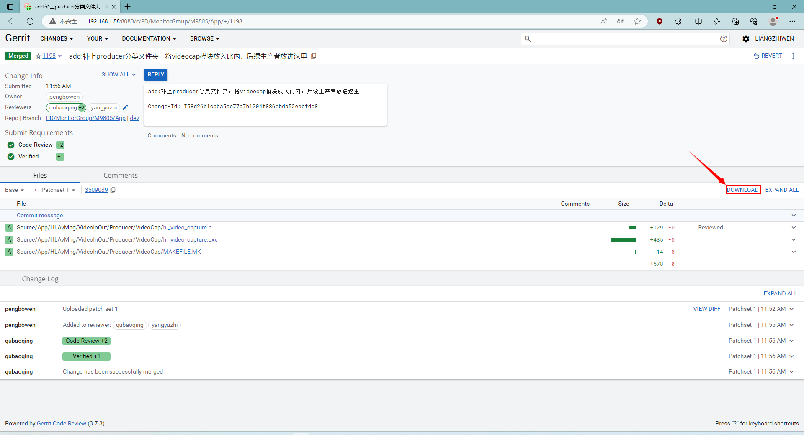

# Gerrit使用教程

## 1 简介

​		Gerrit 是建立在 git 版本控制系统之上的、基于 web 的代码审核工具。Gerrit 是免费的，开源的，有一个可视化界面可供用户操作，主要解决的问题是代码审核。它在传统的源码工具管理协作流程中强制性引入代码审核机制，通过人工代码审核和自动化代码验证的方式，不符合要求的代码屏蔽在代码库之外，确保核心代码多人校验、多人互备和自动化构建核验。

### 1.1 Gerrit 和 Git 区别

​		Git 是一种版本控制系统；而 Gerrit 是一种基于 Web 的代码审查软件。
​		Git 用于代码的存储和版本控制；Gerrit 用于团队间相互审阅彼此修改后的程序代码，决定是否能够提交，退回或者继续修改。

### 1.2 Gerrit 和 Gitlab 区别

* **开发风格**

​		gitlab 的特点**是一个人**维系一个分支。
​		gerrit 的特点是**一个团队**维系一个分支。

* **权限管理**

​		gitlab 可以根据需要创建 project，每个团队可以根据自己的需求管理自己的代码，方式更加的灵活。
gerrit 比较单一，而且权限配置比较复杂，往往都是要联系管理员做出修改，每个团队很难做到对代码的个性化管理。

* **代码评审**

​		gitlab 是以 merge request 作为一次 review，merge request 中可能包含多个 commit，如果 review 不通过也不需要发起另一次 merge request。
​		gerrit 是以 commit 作为一次 review，由于 changeId 的存在，可以对一次commit反复的进行review。 如果task划分的粒度够细的话，并不会影响各个团队的review习惯。

* **团队协作**

​		gitlab 可以选择公开代码，团队间可以看到互相的代码，有利于团队的协作。
gerrit 由于权限控制问题，只能在权限范围内公开代码。

* **信息共享**

​		gitlab 可以提供 issues，wiki 等功能方便开发者与使用者之间的沟通，并且 gitlab 可以无缝的与一些项目管理工具集成，比如:jira。
gerrit 这个方面比较欠缺。

## 2 工作流程

如果你使用过 git，当我们 git add --> git commit --> git push 之后，你的代码会被直接提交到 repo，也就是代码仓库中。
而 Gerrit 的流程：

* 程序员编写代码。
* push 到 gerrit 服务器。
* 审核人员，在 web 页面进行代码的审核(review)，（可以单人审核，也可以邀请其他成员一同审核）。
* 审核通过(approve)之后。
* 提交(submit)到代码仓库(repo)中去


在使用过程中，有两点需要特别注意下：

1. 当进行 commit 时，必须要生成一个 Change-Id，否则，push 到 gerrit 服务器时，会收到一个错误提醒。
   提交者不能直接把代码推到远程的 master 主线(或者其他远程分支)上去。这样就相当于越过了 gerrit了。 gerrit 必须依赖于一个 refs/for/*的分支。假如我们远程只有一个 master 主线，那么只有当你的代码被提交到 refs/for/master 分支时，gerrit 才会知道，我收到了一个需要审核的代码推送，需要通知审核员来审核代码了。
2. 当审核通过之后，gerrit 会自动将这条分支合并到 master 主线上，然后邮件通知相关成员，master 分支有更新，需要的成员再去pull就好了。

## 3 常用命令

### git status

查看当前git状态

### git add

```bash
#添加某个文件到缓存(暂存区)
git add xxx.c
#添加所有git所追踪的文件
git add --all
```

添加某个文件到git缓存(暂存区)，如果不想从缓存内移除该文件，可以使用git reset xxx.c命令，如果参数是某个文件夹，则添加这个文件内所有git的追踪文件

### git commit

将add的缓存添加到本地仓库，如果需要修改本次提交，可以使用git commit --amend命令

```bash
#将缓存区内容保存至本地仓库
git commit
#修改上一次提交
git commit --amend
```

### git diff

```bash
#查看当前追踪文件修改和原文件的差异，不指定文件则为所有文件
git diff xxx.c
```

可以使用 “>>”将差异重定向输出到指定文件

例子

```bash
git diff xxx.c >> xxx.diff
```

### git push

```bash
#推送本地分支到远程分支(不用)
git push [远程仓库名[分支名]
#对于gerrit使用一下命令
git push origin [本地分支名]:refs/for/[远程分支名]
```

### git pull

```bash
#拉取远程分支，在gerrit下一般使用git pull --rebase,保证提交的代码是基于最新的节点
git pull --rebase
```

### git log

```bash
#查看提交log
git log
#查看提交log,并显示修改的文件
git log --stat
#查看xxx的提交log
git log --author=xxx
#以单行显示提交log
git log --oneline
```

在查看log是可以单击”/“键以关键查询

### git show

```bash
#查看某个提交的具体修改
git show <commit>
```

### git branch

```bash
#查看所有本地分支
git branch
#新建branch_name的分支
git branch branch_name
#查看本地分支追踪的远程的分支
git branch -vv
#查看所有分支(包括远程分支)
git branch --all
#删除某个本地分支
git branch -d branch_name
#强制删除某个分支
git branch -D branch_name
```

### git reset

git reset是一个用于撤销更改的git更改

```bash
#将缓存区中的更改撤销
git reset <文件名>
#将当前分支的HEAD指针移动打指定的commit，但保留工作区和暂存区的修改
git reset --soft
#将当前分支的HEAD指针移动打指定的commit，并将工作区和暂存区都恢复到指定的提交状态。(慎用)
git reset --hard
#这是默认的reset模式，将当前分支的HEAD指针移动打指定的commit，并将暂存区恢复到指定的提交状态，但工作区的修改会保留。这个命令可以用于取消暂存的文件，同时保留修改。
get reset --mix
```

### git revert 

```bash
#git revert 是一个用于撤销之前的更改的命令。它会创建一个新的提交，用于撤销之前的提交。
git revert <commit>
```

### git rebase

```bash
#改名用于一条分支上的提交应用到另一个分支，一般只用于本地分支
git rebase source_branch
```

1. 首先，切换到需要被应用提交的目标分支
2. 然后执行命令git rebase source_branch
3. git会将source_branch上的提交按照顺序依次应用到target_branch上。参考git pull --rebase命令

### git stash

```bash
#执行存储时，添加备注，方便查找，只有git stash 也要可以的，但查找时不方便识别。
git stash save "save message"
#查看stash了哪些存储
git stash list
#显示做了哪些改动，默认show第一个存储,如果要显示其他存贮，后面加stash@{$num}，比如第二个 git stash show stash@{1}
git stash show
#显示第一个存储的改动，如果想显示其他存存储，命令：git stash show  stash@{$num}  -p ，比如第二个：git stash show  stash@{1}  -p
git stash show -p
#应用某个存储,但不会把存储从存储列表中删除，默认使用第一个存储,即stash@{0}，如果要使用其他个，git stash apply stash@{$num} ， 比如第二个：git stash apply stash@{1} 
git stash apply
#命令恢复之前缓存的工作目录，将缓存堆栈中的对应stash删除，并将对应修改应用到当前的工作目录下,默认为第一个stash,即stash@{0}，如果要应用并删除其他stash，命令：git stash pop stash@{$num} ，比如应用并删除第二个：git stash pop stash@{1}
git stash pop
#丢弃stash@{$num}存储，从列表中删除这个存储
git stash drop stash@{$num}
#删除所有缓存的stash
git stash clear
```

### git format-patch

```bash
#将一个或多个提交(commit)以xxx.patch的形式导出文件
git format-patch -$num
#例git format-patch -3 则表示当前commit节点到第3个commit节点生成3个patch
```

### git apply

```bash
#应用某个patch或diff的修改,不会形成commit
git apply test.patch
git apply xxx.diff
```

### git am

```bash
#应用某个patch的提交，并将HEAD指针移动到该patch的commit
git am test.patch
```

### git blame

```bash
#该命令用于查看是谁修改了某个文件，并显示commit id和修改时间，行号等
git blame xxx.c
```

实例

```
23dbb70a (libo        2023-04-03 03:49:24 +0000 193)             return SDI_MODE1;
23dbb70a (libo        2023-04-03 03:49:24 +0000 194)         } else if (u8ScreenOutType == EM_MCU_OUT_SOC) {
23dbb70a (libo        2023-04-03 03:49:24 +0000 195)             return SDI_MODE2;
23dbb70a (libo        2023-04-03 03:49:24 +0000 196)         }
23dbb70a (libo        2023-04-03 03:49:24 +0000 197)     }
23dbb70a (libo        2023-04-03 03:49:24 +0000 198)     return 99;
23dbb70a (libo        2023-04-03 03:49:24 +0000 199) }
23dbb70a (libo        2023-04-03 03:49:24 +0000 200)
a698a0de (liangzhiwen 2023-08-24 09:21:12 +0000 201) static void _66121_input_config(uint8_t In_vic)
a698a0de (liangzhiwen 2023-08-24 09:21:12 +0000 202) {
a698a0de (liangzhiwen 2023-08-24 09:21:12 +0000 203)     switch (In_vic) {
a698a0de (liangzhiwen 2023-08-24 09:21:12 +0000 204)     case VFMT_CEA_06_720x480I_60HZ:
a698a0de (liangzhiwen 2023-08-24 09:21:12 +0000 205)         CHANGE_INPUT(IDM_HDMI_480i60_16x9);
a698a0de (liangzhiwen 2023-08-24 09:21:12 +0000 206)         break;
a698a0de (liangzhiwen 2023-08-24 09:21:12 +0000 207)     case VFMT_CEA_02_720x480P_60HZ:
```

通常会加上-L [n]参数指定起始行号

```bash
git blame xxx.c -L 100
```

更多见官网教程：git-scm.com/book/zh/v2

## 4 常见使用场景&问题

### 4.1 本地分支产生了一个修改，需要推送gerrit服务器上进行review

```bash
git push origin HEAD:refs/for/master
```

HEAD代表是当前所在的分支，master为远程分支名，如果需要推送其它的本地分支的提交可以执行

```bash
git push origin branch_name:refs/for/master
```

### 4.2 提交的commit被reviewer打-1，要求修改后重新提交

​		在当前的commit下，修改需要修改的文件，重新git add xxx.c，之后执行git commit --amend命令，再进行push操作。

操作实例

```bash
git add test.c
git commit -m "a commit"
git push origin HEAD:refs/for/master
#省略打印
git add test.c
git commit --amend
git push origin HEAD:refs/for/master
```

### 4.3 拉取服务器上最新的代码

每次提交代码之前都需要执行以下命令，保证提交的代码是基于最新的代码

```bash
git pull --rebase
```

   这时，可能会出现有其他人提交的代码已经合并(summit)，合并的代码和你提交的代码修改了同一个地方，这时会产生冲突(merge conflict)，拉取git pull --rebase会”卡住“，这时，执行git log，会看不到自己的提交，这时可以使用git status查看当前的状态，查看修改冲突的文件，解决完冲突之后，重新git add xxx.c冲突的文件，之后执行git rebase --continue，就可以了。如果本地分支上有其他问题提交的修改，会导致拉取失败，此时可以使用git stash 暂存修改，再进行拉取。

操作实例

```bash
git stash
git pull --rebase
#失败信息
git status #查看当前状态
#解决冲突的文件
git add xxx.c #添加解决冲突完成的文件
git rebase --continue #重新rebase
#提交修改
git push origin HEAD:refs/for/master
```

### 4.4 新建本地分支，并追踪服务器上的分支

有时候，当正在进行一项功能的开发，临时接到一个紧急问题需要解决(修bug)，可以新建一个分支，用于bug的修复，单独提交而不影响当前的开发工作。

操作实例

```bash
#新建分支
git branch fix_branch
#设置fix_branch追踪master分支
git branch --set-upstream-to=origin/master fix_branch
#git stash或commit保存当前的修改
#切换到fix_branch
git checkout fix_branch
#修改完成后
git add fix_bug.c
git commit -m "fix a bug"
git push origin 切换到fix_branch:refs/for/master
#切换回原来本地的master分支
git checkout master
#git stash pop 还原修改或在保存的commit上继续修改
#不在使用fix_branch时，可以使用git branch -d 删除分支
git branch -d fix_branch
```

### 4.5 需要将某个人的未合并提交拉到本地进行调试或验证

* 可以通过让提交人使用git format-patch或生成修改patch，然后使用git apply或git am命令应用修改

* 可以先推送到gerrit上，再直接到gerrit网站上直接下载下来(推荐使用此方法)

1. 打开gerrit并进入到patch，单机"DOWNLOAD"



2. 单击SSH，复制链接


3. 到终端输入该命令即可


